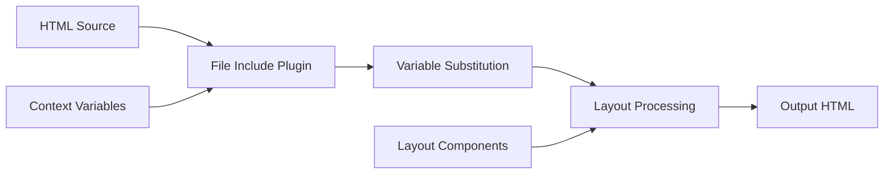

# 🏗️ Build System Architecture

Understanding Admindek's Vite 7-based build system and how it powers development and production workflows.

## Overview

Admindek VanillaJS uses **Vite 7** as its build system, replacing the previous Gulp-based workflow. This modern approach provides faster development, better optimization, and a more maintainable build process.

## Why Vite 7?

### Advantages Over Traditional Build Tools

**Development Speed:**
- ⚡ **Instant server start** - No bundling during development
- 🔄 **Lightning-fast HMR** - Updates in milliseconds
- 🎯 **On-demand compilation** - Only processes what's needed

**Modern Architecture:**
- 📦 **ES modules first** - Native browser module support
- 🌳 **Advanced tree shaking** - Eliminates dead code effectively
- ⚙️ **Rollup-based bundling** - Optimal production builds

**Developer Experience:**
- 🔧 **Simple configuration** - Less boilerplate than Webpack
- 🐛 **Better error messages** - Clear, actionable feedback
- 🔌 **Rich plugin ecosystem** - Easy extensibility

## Architecture Overview

```
Admindek Build System (Vite 7)
├── 🔧 Development Mode
│   ├── ES Module Server
│   ├── Template Processing
│   ├── SCSS Compilation
│   └── Asset Serving
│
├── 📦 Production Build
│   ├── Rollup Bundling
│   ├── Code Minification
│   ├── Asset Optimization
│   └── Legacy Support
│
└── 🎛️ Custom Plugins
    ├── HTML Template Processing
    ├── Asset Copying
    └── Development Middleware
```

## Development Mode

### ES Module Server

Vite serves your code as native ES modules during development:

```javascript
// Source code (as written)
import './style.scss'
import { Chart } from './components/chart.js'

// Served to browser (transformed)
import './style.scss?direct'
import { Chart } from './components/chart.js?v=abc123'
```

**Benefits:**
- No bundling step required
- Fast cold starts
- Efficient cache invalidation
- Real browser module loading

### Template Processing Pipeline



**Process Flow:**

1. **Source Scanning**: Vite discovers HTML entry points
2. **Include Resolution**: `@@include()` statements processed
3. **Variable Substitution**: Template variables replaced
4. **Asset Processing**: CSS/JS imports handled
5. **Browser Serving**: Processed HTML served to browser

### SCSS Compilation

Real-time SCSS processing with dependency tracking:

```scss
// main.scss (entry point)
@import 'bootstrap/scss/bootstrap';
@import 'settings/theme-variables';
@import 'themes/components/card';

// Vite processes:
// 1. Resolves @import paths
// 2. Compiles SCSS to CSS
// 3. Applies PostCSS processing
// 4. Serves to browser with source maps
```

**Features:**
- **Incremental compilation** - Only recompiles changed files
- **Dependency tracking** - Auto-recompile when imports change
- **Source maps** - Debug original SCSS in browser
- **PostCSS integration** - Autoprefixer, custom transforms

## Production Build

### Rollup-Based Bundling

Production builds use Rollup for optimal output:

```javascript
// vite.config.js production settings
export default defineConfig({
  build: {
    rollupOptions: {
      input: {
        main: 'src/main.js',
        style: 'src/style.js',
        'admin-dashboard': 'src/html/dashboard/index.html'
      },
      output: {
        manualChunks: {
          vendor: ['bootstrap', 'apexcharts'],
          utils: ['src/assets/js/script.js']
        }
      }
    }
  }
})
```

**Optimization Steps:**

1. **Entry Point Discovery**: Multiple HTML/JS entry points
2. **Dependency Analysis**: Build dependency graph
3. **Code Splitting**: Separate vendor, utils, and app code
4. **Tree Shaking**: Remove unused exports
5. **Minification**: Terser for JS, cssnano for CSS
6. **Asset Hashing**: Cache-friendly file names

### Bundle Output Structure

```
dist/
├── assets/
│   ├── css/
│   │   ├── style-[hash].css          # Main styles
│   │   ├── style-legacy-[hash].css   # Legacy browser styles
│   │   └── vendor-[hash].css         # Third-party CSS
│   ├── js/
│   │   ├── main-[hash].js           # Application code
│   │   ├── vendor-[hash].js         # Libraries (Bootstrap, etc.)
│   │   ├── charts-[hash].js         # Chart libraries
│   │   └── polyfills-[hash].js      # Browser polyfills
│   ├── images/                      # Optimized images
│   └── fonts/                       # Font files
├── dashboard/
│   ├── index.html                   # Processed HTML
│   └── analytics.html
└── [other-pages].html
```

### Code Splitting Strategy

**Vendor Chunk:**
```javascript
manualChunks: {
  vendor: [
    'bootstrap',           // UI framework
    '@popperjs/core'       // Bootstrap dependency
  ],
  charts: [
    'apexcharts',          // Chart library
    'peity-vanilla'        // Small charts
  ],
  utils: [
    'src/assets/js/script.js',    // Core utilities
    'src/assets/js/theme.js'      // Theme functionality
  ]
}
```

**Benefits:**
- **Smaller initial bundles** - Faster page loads
- **Better caching** - Vendor code cached separately
- **Parallel loading** - Multiple chunks load simultaneously
- **Selective loading** - Load only needed code

## Custom Plugins

### File Include Plugin

Processes `@@include()` syntax for HTML templating:

```javascript
// plugins/vite-plugin-file-include.js
export function vitePluginFileInclude(options = {}) {
  return {
    name: 'vite-plugin-file-include',
    transformIndexHtml: {
      enforce: 'pre',
      transform(html, context) {
        return processIncludes(html, options.context || {})
      }
    }
  }
}

// Usage in templates
@@include('../layouts/head-css.html')
@@include('../layouts/breadcrumb.html', {
  'title': 'Dashboard',
  'subtitle': 'Analytics'
})
```

**Features:**
- **Recursive includes** - Includes can include other files
- **Context variables** - Pass data to included templates
- **Relative path resolution** - Automatic path handling
- **Watch integration** - Rebuilds when includes change

### Asset Copy Plugin

Copies vendor assets from node_modules:

```javascript
// plugins/vite-plugin-copy-assets.js
export function vitePluginCopyAssets(options = {}) {
  return {
    name: 'vite-plugin-copy-assets',
    buildStart() {
      options.assets.forEach(asset => {
        copyFileSync(
          resolve('node_modules', asset.from),
          resolve('dist', asset.to)
        )
      })
    }
  }
}

// Asset configuration
const vendorAssets = [
  {
    from: 'bootstrap/dist/js/bootstrap.min.js',
    to: 'assets/js/plugins/bootstrap.min.js'
  },
  {
    from: 'apexcharts/dist/apexcharts.min.js',
    to: 'assets/js/plugins/apexcharts.min.js'
  }
]
```

### Development Middleware

Custom middleware for development server:

```javascript
// plugins/vite-plugin-html-dev-server.js
export function vitePluginHtmlDevServer() {
  return {
    name: 'html-dev-server',
    configureServer(server) {
      server.middlewares.use('/dashboard', (req, res, next) => {
        // Handle HTML routing
        if (req.url.endsWith('.html')) {
          // Serve processed HTML
          serveProcessedHTML(req, res)
        } else {
          next()
        }
      })
    }
  }
}
```

## Performance Optimizations

### Development Optimizations

**Dependency Pre-bundling:**
```javascript
// vite.config.js
export default defineConfig({
  optimizeDeps: {
    include: [
      'bootstrap',           // Pre-bundle large dependencies
      'apexcharts'
    ],
    exclude: [
      'some-esm-package'     // Skip packages that are already ES modules
    ]
  }
})
```

**Fast Refresh:**
```javascript
// Efficient cache invalidation
server: {
  hmr: {
    overlay: true,         // Show errors in browser
    clientPort: 24678     // Custom HMR port
  },
  fs: {
    allow: ['..']          // Allow access to parent directories
  }
}
```

### Production Optimizations

**Minification Settings:**
```javascript
build: {
  minify: 'terser',
  terserOptions: {
    compress: {
      drop_console: true,      // Remove console.log
      drop_debugger: true      // Remove debugger statements
    },
    mangle: {
      keep_classnames: true    // Preserve class names for CSS
    }
  }
}
```

**Asset Optimization:**
```javascript
build: {
  assetsInlineLimit: 4096,   // Inline assets < 4KB
  cssCodeSplit: true,        // Split CSS by entry point
  reportCompressedSize: false // Faster builds
}
```

## Legacy Browser Support

### Polyfill Strategy

```javascript
// vite.config.js
import legacy from '@vitejs/plugin-legacy'

export default defineConfig({
  plugins: [
    legacy({
      targets: ['defaults', 'not IE 11'],
      additionalLegacyPolyfills: ['regenerator-runtime/runtime'],
      polyfills: [
        'es.symbol',
        'es.promise',
        'es.promise.finally',
        'es/map',
        'es/set'
      ]
    })
  ]
})
```

**Output:**
```html
<!-- Modern browsers -->
<script type="module" src="/assets/index-[hash].js"></script>

<!-- Legacy browsers -->
<script nomodule src="/assets/index-legacy-[hash].js"></script>
<script nomodule src="/assets/polyfills-legacy-[hash].js"></script>
```

### Feature Detection

```javascript
// Progressive enhancement approach
if ('IntersectionObserver' in window) {
  // Use modern intersection observer
  initLazyLoading()
} else {
  // Fallback for older browsers
  loadAllImages()
}
```

## Build Performance

### Build Time Optimization

**Parallel Processing:**
```javascript
build: {
  rollupOptions: {
    output: {
      // Enable parallel chunk generation
      experimentalMinChunkSize: 1000
    }
  }
}
```

**Cache Strategy:**
```javascript
// Vite automatically caches:
// - node_modules/.vite/       (dependency cache)
// - node_modules/.vite/deps/  (pre-bundled dependencies)

// Clear cache when needed:
// rm -rf node_modules/.vite
```

### Bundle Analysis

```bash
# Generate bundle analysis
npm run build-prod -- --analyze

# Generates:
# - dist/stats.html (visual bundle analyzer)
# - Bundle size warnings in console
```

**Optimization Insights:**
- Identify large dependencies
- Find duplicate code
- Analyze chunk distribution
- Monitor bundle growth over time

## Environment Handling

### Development vs Production

```javascript
// Environment-specific configuration
export default defineConfig(({ command, mode }) => {
  const isDev = command === 'serve'
  const isProd = mode === 'production'
  
  return {
    plugins: [
      // Development-only plugins
      ...(isDev ? [developmentPlugin()] : []),
      // Production-only plugins
      ...(isProd ? [productionPlugin()] : [])
    ],
    
    build: {
      sourcemap: isDev,        // Source maps only in dev
      minify: isProd           // Minify only in production
    }
  }
})
```

### Environment Variables

```javascript
// .env files loaded automatically
// .env                 (all environments)
// .env.development     (development only)
// .env.production      (production only)

// Usage in code
if (import.meta.env.PROD) {
  // Production-only code
  enableAnalytics()
}

if (import.meta.env.DEV) {
  // Development-only code
  enableDebugMode()
}
```

## Monitoring and Debugging

### Build Insights

```javascript
// vite.config.js - Add build insights
export default defineConfig({
  build: {
    rollupOptions: {
      plugins: [
        // Custom plugin to log build info
        {
          name: 'build-info',
          generateBundle(options, bundle) {
            console.log(`Generated ${Object.keys(bundle).length} assets`)
            
            // Log largest chunks
            const chunks = Object.values(bundle)
              .filter(chunk => chunk.type === 'chunk')
              .sort((a, b) => b.code.length - a.code.length)
              .slice(0, 5)
            
            console.log('Largest chunks:', chunks.map(c => c.fileName))
          }
        }
      ]
    }
  }
})
```

### Development Debugging

```javascript
// Enhanced logging during development
if (import.meta.env.DEV) {
  console.log('Build info:', {
    mode: import.meta.env.MODE,
    base: import.meta.env.BASE_URL,
    prod: import.meta.env.PROD
  })
}
```

## Migration Benefits

### From Gulp to Vite

**Performance Improvements:**
- ⚡ **5x faster development builds** (0.5s vs 2.5s)
- 🔄 **Instant HMR** vs page reloads
- 📦 **Smaller production bundles** (tree shaking)
- 🚀 **Faster production builds** (parallel processing)

**Developer Experience:**
- 🔧 **Simpler configuration** (150 lines vs 400+ lines)
- 🐛 **Better error messages** with source locations
- 🔌 **Modern tooling** ecosystem
- 📱 **Better debugging** support

**Maintainability:**
- 📚 **Standard configuration** patterns
- 🔄 **Active development** and updates
- 🏗️ **Future-proof** architecture
- 🤝 **Large community** support

---

## Summary

Vite 7 provides Admindek with a modern, efficient build system that:

- **Enhances development speed** with instant starts and fast HMR
- **Optimizes production builds** with advanced code splitting
- **Simplifies configuration** compared to traditional tools
- **Future-proofs the template** with modern web standards

This architecture enables developers to build faster, deploy efficiently, and maintain code more easily while providing the best possible user experience.